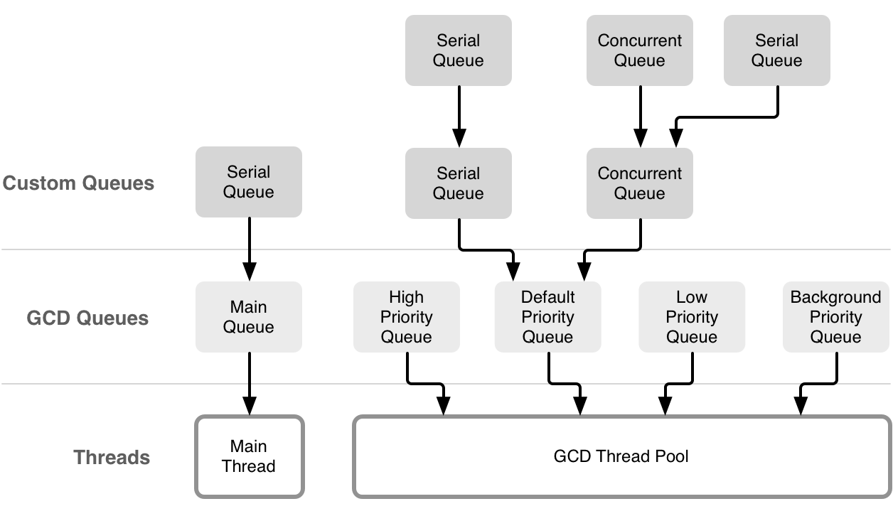

# Concurrency-GCD-Operations
---
## Grand Central Dispatch
### Under the Hood:

* Main Dispatch Queue (Serial)
* 4 Global Queues (Concurrent) of different priorities supporting the following Qos classes:
  * `.userInteractive` 
  * `.userInitiated`
  * `.default`
  * `.utility`
  * `.background`
* Any Custom Serial/Concurrent Dispatch Queues created by the developer
* A Pool of Threads servicing all Dispatch Queues other than the Main Queue


Image from [objc.io](https://www.objc.io/issues/2-concurrency/concurrency-apis-and-pitfalls/#run-loops)

---
### Dispatch Queues:
* Serial Queue
  * Each Serial Queues has a single thread associated with it, thus only one task is executed at a given time.
* Concurrent Queue
  * A Concurrent Queue is serviced by multiple threads, thus a task does not need to complete execution before the next task begins.

```Swift
// Access the Main Queue
DispatchQueue.main

// Access the a Global Dispatch Queue 
DispatchQueue.global(qos: .userInteractive)

// Create a custom Serial Queue
DispatchQueue(label: "com.some.seralQueue")

// Create a custom Concurrent Queue
DispatchQueue(label: "com.some.concurrentQueue", attributes: .concurrent)
```
---
### Synchronous & Asynchronous Tasks (Dispatch Work Items):
* Synchronous Task
  * The calling thread blocks until the task that is submitted to the dispatch queue is complete.
* Asynchronous Task
  * The calling thread enqueues the task & control returns to the calling thread immediately.

```Swift
// Important: Asynchronous does not mean Concurrent
// Tasks that are asynchronous doesn't mean they run concurrently
// Here we run an asynchronous task on a serial queue
DispatchQueue(label: "com.some.seralQueue").async {
    print(Thread.current)
}

// So what happens when we try to execute a synchronous task on a 
// the a serial queue being serviced by the calling thread?
let serialQueue = DispatchQueue(label: "com.some.seralQueue")
serialQueue.async {

    // This leads to a deadlock:
    // The calling thread blocks waiting for the synchronous task to complete,
    // but the synchronous task cannot begin because the calling thread is blocked
    serialQueue.sync {
        print(Thread.current)
    }
}

// This next snippet will also cause a deadlock:
// Trying to execute a synchronous task on the main dispatch queue from the main thread
DispatchQueue.main.sync {
    print(Thread.current)
}
```
---
### Dispatch Group:
Now that we're able to run multiple tasks on multiple threads, is there a way to know if all of them have completed execution?
Dispatch group allows us to do just this.
```Swift
// Create a dispatch group
let dispatchGroup = DispatchGroup()

// Add a task to the dispatch group and dispatch it to the background queue
DispatchQueue.global(qos: .background).async(group: dispatchGroup) {
    Thread.sleep(forTimeInterval: 5)
    print("background task completed")
}

// Add another task to the dispatch group and dispatch it to the utility queue
DispatchQueue.global(qos: .utility).async(group: dispatchGroup) {
    Thread.sleep(forTimeInterval: 1)
    print("utility task completed")
}

// Add another task to the dispatch group and dispatch it to the user-initiated queue
DispatchQueue.global(qos: .userInitiated).async(group: dispatchGroup) {
    print("user-initiated task")
}

// Get notified on the main queue when all tasks added to the dispatch group have completed
dispatchGroup.notify(queue: DispatchQueue.main) {
    print("all tasks have completed")
}
```
It is important to note that __dispatch group notification is asynchronous__, so if more tasks are submitted after calling `notify`, the __notification gets fired again__ after these tasks complete.

This seems convenient and all, but what if instead of getting notified, I'd want to block and wait until all tasks have completed? We can do that - using the `wait` call.
```Swift
// Create a dispatch group
let dispatchGroup = DispatchGroup()

// Add tasks to the same dispatch group and dispatch them onto different dispatch queue
DispatchQueue.global(qos: .background).async(group: dispatchGroup) {
    Thread.sleep(forTimeInterval: 5)
    print("background task completed")
}
DispatchQueue.global(qos: .utility).async(group: dispatchGroup) {
    Thread.sleep(forTimeInterval: 1)
    print("utility task completed")
}
DispatchQueue.global(qos: .userInitiated).async(group: dispatchGroup) {
    print("user-initiated task")
}

// Block & wait for the tasks to complete
// The wait call takes a timeout parameter and returns a DispatchTimeoutResult
// to indicate whether tasks completed before the timeout expires (success), 
// or that tasks were not able to complete (timeOut)
switch dispatchGroup.wait(timeout: .now() + 4) {
case .success:
    print("success")
case .timedOut:
    print("timed-out")
}
```
Above covers a lot of the day-to-day uses of dispatch groups, but there is one other use case that's equally important:

What if I'm making an async call inside my async task & want to get notified after that async call completes instead? Dispatch group's `enter` & `leave` primitives lets us do just that.
```Swift
// Create a dispatch group
let dispatchGroup = DispatchGroup()

// Add a task to the dispatch group and dispatch it to the utility queue 
DispatchQueue.global(qos: .utility).async(group: dispatchGroup) {

    // We don't want to get notified when this block returns,
    // instead we want to get notified when the async call below
    // finishes execution
    // Call enter() to increment the dispatch group's task book-keeping
    dispatchGroup.enter()
    
    DispatchQueue.main.asyncAfter(deadline: .now() + 6) {
        // Remember to call leave() to balance the enter(),
        // otherwise we will never get notified
        defer { dispatchGroup.leave() }
        print("async call complete")
    }
}

// Get notified on the main queue when async call completes
dispatchGroup.notify(queue: DispatchQueue.main) {
    print("all tasks have completed")
}
```
---
### Semaphore:
Knowing how to use Dispatch Groups to get notified when concurrent tasks complete is certainly useful, but we're also interested in having control over the number of concurrent accesses to a shared resource. This is where semaphores come in handy.
```Swift
// Create a dispatch group so we can get notified when all tasks have completed
let dispatchGroup = DispatchGroup()

// Create a semaphore with value 3, this limits the number of concurrent access to a shared resource to 3
let semaphore = DispatchSemaphore(value: 3)

// Create 10 tasks and add them to the utility queue
for i in 1...10 {

    DispatchQueue.global(qos: .utility).async(group: dispatchGroup) {
    
        // Call wait on semaphore to signal that the task is entering the critical section,
        // and balance the wait() with a signal() on exiting the critical section
        semaphore.wait()
        defer { semaphore.signal() }
        
        print("task \(i) started")
        Thread.sleep(forTimeInterval: 3)
        print("task \(i) complete")
    }
}

// Get notified on the main queue when all tasks complete
dispatchGroup.notify(queue: DispatchQueue.main) {
    print("all tasks have completed")
}
```
---
### Dispatch Barrier:
With semaphores we're now able limit the number of concurrent accesses to the same resource. But is it really a good idea to allow __concurrent reads/writes of the same resource__ without more control? Without proper protection of the resource, it's merely a matter of time before we find ourselves struggling with __race conditions__.

Race conditions can always be avoided by ensuring that accesses to the same resource are serial (ie, dispatching tasks to the same serial dispatch queue), but we end up taking a performance hit. This is because we're serializing all the reads & writes even though we can safely allow concurrent reads as they don't modify the resource itself.

The goal here is to identify a means to __blocking writes & non-blocking reads__. We use dispatch barriers to accomplish exactly this.
```Swift
// Setup a concurrent queue to allow concurrent access to a shared resource
private let concurrentQueue = DispatchQueue(label: "com.queue.concurrent", attributes: .concurrent)

// Initialize the shared resource
private var sharedResource : Int = 0

// Provide public accessors to the shared resource
public var value: Int {
    get {
        // Allow concurrent reads of the shared resource
        return concurrentQueue.sync {
            return sharedResource
        }
    }
    set {
        // Use barrier to ensure that writes to the shared resource blocks all other accesses
        concurrentQueue.async(flags: .barrier) {
            sharedResource = newValue
        }
    }
}
```
---
## Operation
### Block Operation:
Concurrent task dispatches can alternatively be implemented via block operations. A `BlockOperation` manages concurrent execution of a group of tasks on the `.default` global queue.
```Swift
// Intialize a block operation with a single task
let singleOperation = BlockOperation {
    print("single task")
}

// Kick-off the block operation
singleOperation.start()


// Intialize a block operation
let adhocOperation = BlockOperation()

// Define a completion block to get notified when all tasks have completed
adhocOperation.completionBlock = {
    print("all tasks have completed")
}

// Add tasks to the to the block operation
for task in 0..<10 {
    adhocOperation.addExecutionBlock {
        Thread.sleep(forTimeInterval: 2)
        print("task \(task)")
    }
}

// Kick-off the block operation
adhocOperation.start()
```
By now the curious mind is probably wondering: why do we need operations? It seems everything we've done with operations so far can equivalently be achieved using GCD. Operations are a level of abstraction above GCD & offers a bit more capability out of the box, and certainly deserves a proper introduction.

---
### Operation & Operation Queue:
GCD is unarguably the better choice when it comes to fire & forget tasks, but operations allow for better control over submitted tasks. More specifically, operations are different from GCD tasks in the following ways:
* __Features Inter-Operation Dependencies__ - We can setup operations such that they depend on each other
* __Supports Key-Value Coding__ - `Operation` is a `NSObject` subclass
* __Reusable__ - `Operation`s are objects and can be submitted over & over again
* __Cancellable__ - `Operation`s are objects and can store variables, allowing it to manage state. These states are:
  * `isReady`
  * `isExecuting`
  * `isFinished`
  * `isCancelled`
```Swift
// Create a custom operation by subclassing Operation
final class SomeOperation: Operation {
    public let index: Int
    
    // Initializer for dependency injection
    public init(_ index: Int) {
        self.index = index
        super.init()
    }
    
    // Define the body of the operation by overriding main() 
    override func main() {
        print("running operation \(index)")
    }
}

// Execute operation synchronously on the calling thread
SomeOperation(1).start()


// Usually running an operation synchronously is not what we want to do.
// We wouldn't need to go through the trouble of implementing an Operation subclass 
// just to run it synchronously.
// Below is better example of how operations are typically used:

// Create a operation queue
let operationQueue = OperationQueue()

// Declare the maximum number of concurrent operations that can run
operationQueue.maxConcurrentOperationCount = 3

// Assign the operation queue a QoS (default QoS is .background if not explicitly stated)
// or optionally designate an underlying dispatch queue to be used by the operation queue, using:
// operationQueue.underlyingQueue = DispatchQueue.global(qos: .utility)
operationQueue.qualityOfService = .utility

// The operation queue can be suspended at any time
operationQueue.isSuspended = false

// Create a series of operations
let operations = (2...10).map(SomeOperation.init)

// Assign a block of code to be executed when each operation completes
operations.forEach {
    let index = $0.index
    $0.completionBlock = { print("operation \(index) completed") }
}

// Add these operations to the operation queue
operationQueue.addOperations(operations, waitUntilFinished: true)
```
