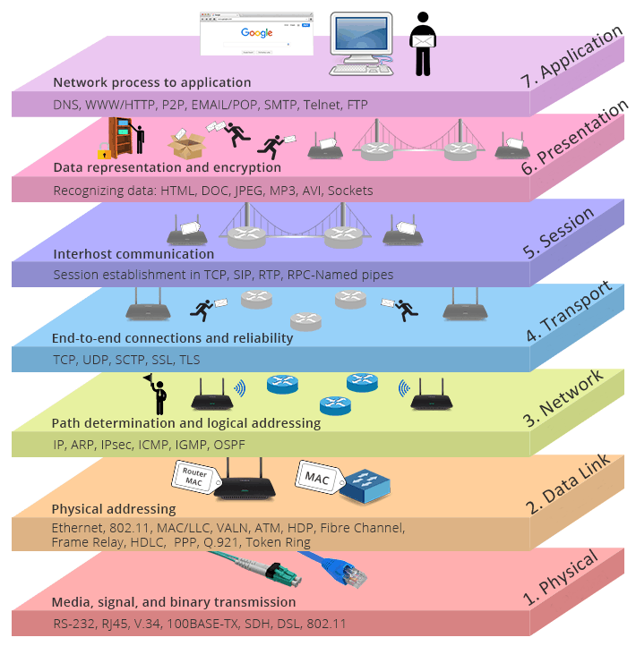
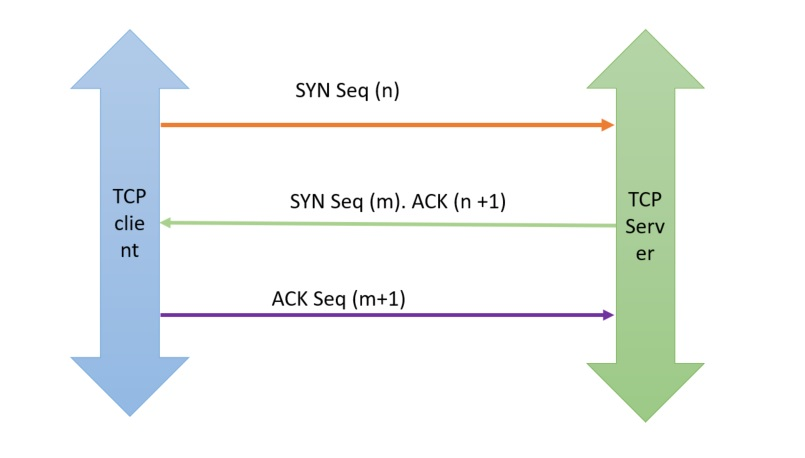

# Open Systems Interconnection Model

Image Source: [TheTechWin](https://thetechwin.wordpress.com/2018/06/23/what-is-osi-model/)

---
## Session
### TCP 3-Way Handshake

Image Source: [CsPsProtocol](https://www.cspsprotocol.com/tcp-three-way-handshake/)
1. __Client connect():__ The client opens a connection, using the server's IP address, the server's port number. The OS sends a `SYN` packet including a random number `n` used as the starting byte sequence of the connection. This randomness minimizes the possibility of other parties from taking over this connection.
2. __Server accept():__ The server process listening for connection requests accepts the incoming connection if the server has sufficient resources, and responds with a `SYN-ACK` packet. This packet contains 2 pieces of information:
    * `ACK` - Acknowldgement to the client's `SYN`, with number `n+1`
    * `SYN` - A random number `m`, chosen by server to be used as the starting sequence in the server-to-client direction
3. __Client ACK:__ The client acknowldeges that it has received the `SYN` from the server by responding with an `ACK` of value `m+1`.

On receiving the `ACK` from the client, the server considers the connection opened, and allocates buffer for receiving packets from the client.
