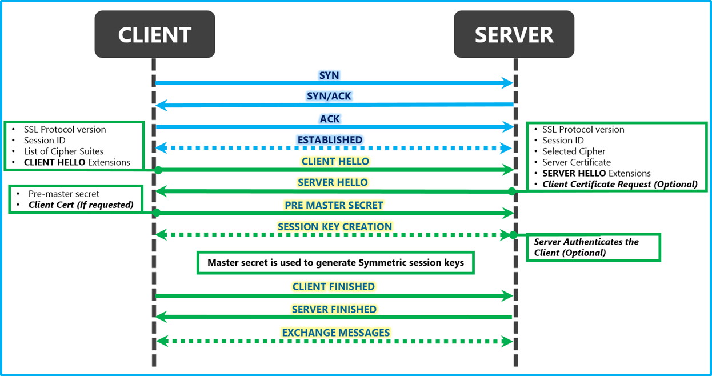
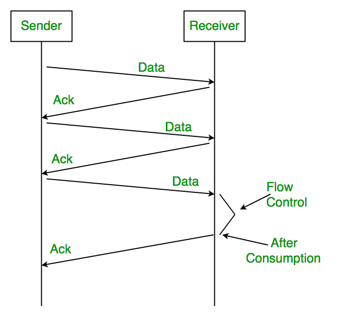

# Open Systems Interconnection Model

Image Source: [TheTechWin](https://thetechwin.wordpress.com/2018/06/23/what-is-osi-model/)

---
## Session
### TCP 3-Way Handshake

Image Source: [CsPsProtocol](https://www.cspsprotocol.com/tcp-three-way-handshake/)

1. __Client connect():__ The client opens a connection, using the server's IP address, the server's port number. The OS sends a `SYN` packet including a random number `n` used as the starting byte sequence of the connection. This randomness minimizes the possibility of other parties from taking over this connection.
2. __Server accept():__ The server process listening for connection requests accepts the incoming connection if the server has sufficient resources, and responds with a `SYN-ACK` packet. This packet contains 2 pieces of information:
    * `ACK` - Acknowldgement to the client's `SYN`, with number `n+1`
    * `SYN` - A random number `m`, chosen by server to be used as the starting sequence in the server-to-client direction
3. __Client ACK:__ The client acknowldeges that it has received the `SYN` from the server by responding with an `ACK` of value `m+1`.

On receiving the `ACK` from the client, the server considers the connection opened, and allocates buffer for receiving packets from the client.

### SSL 4-Way Handshake
Establishing a TCP connection allows us to send data in the clear, but we want to avoid communication in the clear at all costs because this introduces privacy & security issues. The solution is to encrypt the data before sending it. 

There are various options that lets us encrypt data we send & have the recipient decrypt the data when received. Either symmetric or asymmetric cryptography can do the job equally well, but for efficiency reasons we want to use symmetric cryptography if it is at all possible. So what would make symmetric cryptography not possible in our case? The road-block is the exchange of encrytion key. 

We can't send the encryption key in the clear because an eavesdropper can listen in on the line and intercept the encryption key. Asymmetric cryptography solves problems with key exchange, but we don't want to use it for all data exchange because it is too computationally demanding. Is there a middle ground where we can use asymmetric cryptography to bootstrap our symmetric key exchange?

This is where the SSL 4-way handshake comes into play:

Image Source: [MSDN, Microsoft](https://blogs.msdn.microsoft.com)

---
## Transport
### Stop & Wait

Image Source: [GeeksForGeeks](https://www.geeksforgeeks.org/stop-and-wait-arq/)

The sender waits for `ACK` from the receiver on each transmit. If `ACK` isn't received after a timeout period, the same packet is re-transmitted.

### Sliding Window

Image Source: [GeeksForGeeks](https://www.geeksforgeeks.org/sliding-window-protocol-set-3-selective-repeat/)

The sender can send up to `W` packets before receiving an `ACK` from the receiver. Each `ACK` from the receiver makes room for subsequent packets that can be sent by the sender. Packet loss & timeout can be handled the following ways:

#### Go Back N:
* Using `ACK` - When `ACK` for sequence number `N` times out, re-transmit packets starting at number `N`.
* Using `NACK` - When `NACK` for sequence number `N` is received, re-transmit packets starting at number `N`.

#### Selective Repeat:
* Receiver assume most of the time packets are going to arrive in sequential order.
* If packet `N+1` arrives before packet `N`, the receiver sends `NACK` for `N` alongside `ACK` for `N+1`.
