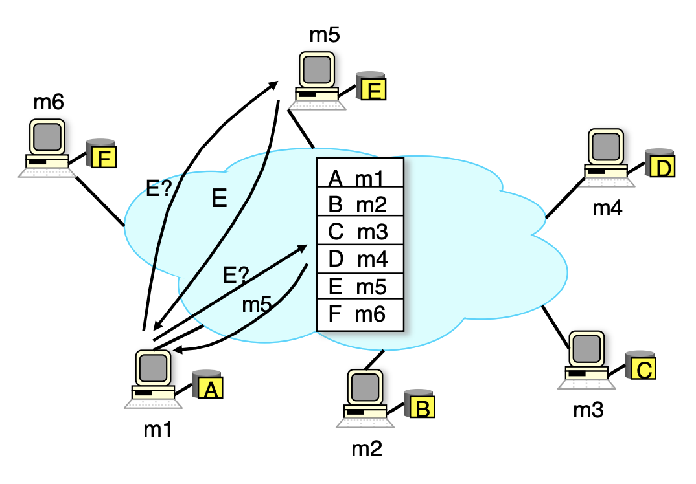

# P2P (Peer-to-Peer) Network
---
## Motivation
The goal of a P2P network is to offload the burden on the service provider by transfering computational, storage bandwidth resource responsibilities to the clients.
It is a service architecture used to provide highly scalable & cost efficient services.

---
## Application
A P2P network can be used for:
* __Content Distribution:__ Napster, BitTorrent
* __Internet Telephony:__ Skype
* __Video Streaming:__ WebRTC
* __Computation:__ Bitcoin

---
## Architecture
### Centralized Lookup Service
If I have some content that I want to share, how do I let everybody else on the network know that it exists? 
Or if I want to search content on the network, how do I know who has it? 

A centralized lookup service is a directory that keeps tracks of who has what content and how it can be contacted. In the example below: 
1. Machine `m1` is looking for content `E`, but it doesn't know which machine on the network has it.
2. `m1` contacts the centralized lookup service, and is informed that machine `m5` has the content.
3. `m1` then connects with `m5` directly for getting content `E`.

Image from [UC Berkeley, CS 162, Fall 2011](https://inst.eecs.berkeley.edu/~cs162/fa11/)

---
## Challenges
* __Dynamicity:__ Each node on the network can be online & offline at any time. How to preserve continuity of service?
* __Heterogeneity:__ Each node on the network has different capacity (bandwidth, computation power). How to preserve reliability?
