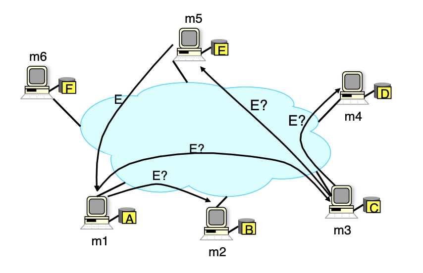
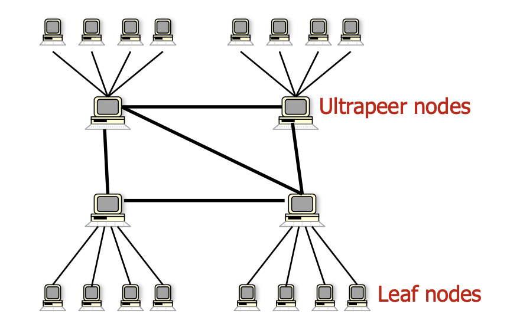

# P2P (Peer-to-Peer) Network
---
## Motivation
The goal of a P2P network is to offload the burden on the service provider by transfering computational, storage bandwidth resource responsibilities to the clients.
It is a service architecture used to provide highly scalable & cost efficient services.

---
## Application
A P2P network can be used for:
* __Content Distribution:__ Napster, BitTorrent
* __Internet Telephony:__ Skype
* __Video Streaming:__ WebRTC
* __Computation:__ Bitcoin

---
## Architecture
---
### Centralized Lookup Service
If I have some content that I want to share, how do I let everybody else on the network know that it exists? 
Or if I want to search content on the network, how do I know who has it? 

A centralized lookup service is a directory that keeps tracks of who has what content and how it can be contacted. In the example below: 
1. Machine `m1` is looking for content `E`, but it doesn't know which machine on the network has it.
2. `m1` contacts the centralized lookup service, and is informed that machine `m5` has the content.
3. `m1` then connects with `m5` directly using the its IP & port as provided by the centralized lookup service to get content `E`.

Image from [UC Berkeley, CS 162, Fall 2011](https://inst.eecs.berkeley.edu/~cs162/fa11/)

__Pros:__
* Easy to implement & deploy sophisticated features on top of a single service 

__Cons:__
* Service needs to scale to handle growing nodes participating on the network
* Single point of failure & single source of legal vulnerability

---
### Gnutella
One way to solve the single point of failure problem with centralized lookup service is to de-centralize the lookup. But now having removed the lookup service, how would I know where to get content? 

When I join the network as a node, I will pick randomly from a list of pre-defined peers (typically hardcoded in the application) and join their network. These peers & their immediate neighbors now become my neighbors. I can then send my requests to my neighbors & have them forward my request downstream. In the example below:
1. Machine `m1` is looking for content `E`, but it doesn't know which machine on the network has it.
2. `m1` sends a quest to its neighbors `m2` & `m3`.
3. Neither `m2` or `m3` have the content, so they forward the request to their neighbors `m4`, `m5` and `m6`.
4. `m5` happens to have the content, so it contacts `m1` to exchange the content.

Image from [UC Berkeley, CS 162, Fall 2011](https://inst.eecs.berkeley.edu/~cs162/fa11/)

__Note:__

A request contains the requesting node's IP & Time-To-Live value - if a request's Time-To-Live reaches 0 before the content is found, the request is dropped altogether. This limits the possibility of requests flooding the network.

__Pros:__
* Completely decentralized 

__Cons:__
* Requests can potentially flood the network as nodes grow, ending up with more query traffic than content traffic
* Horizon effect introduced by Time-To-Live; common resources are easy to find while rare resources can seldom be reached

---
### KaZaa
In addition to some of the problems seen in the previous topologies, there are other challenges yet to be addressed in P2P networks: 
* __Dynamicity:__ Each node on the network can be online & offline at any time. Requests might not make it too far downstream before it is dropped.
* __Heterogeneity:__ Each node on the network has different capacity (bandwidth, computation power). Requests going through a deprived node could lead to a performance bottleneck.

To solve these problems we identify the nodes that are consistently online with good capacity, and designate them as ultra-peers. We can assign these ultra-peers as the first point of contact to all other leaf nodes. Utlra-peers themselves are also connected to fellow ultra-peers, forming a two-level topology. A request going through an ultra-peer is advertised to all leaf nodes & other ultra-peers.

Image from [UC Berkeley, CS 162, Fall 2011](https://inst.eecs.berkeley.edu/~cs162/fa11/)
