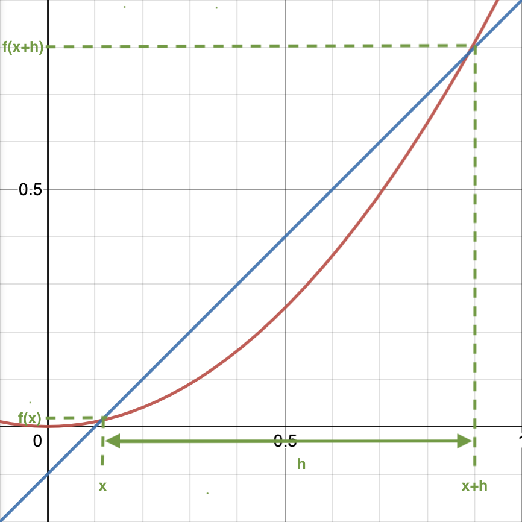



# Calculus
---

## First Principles of Calculus
---

\\(gradient_{m_{secant}} = \cfrac{f(x+h) - f(x)}{h}\\)

\\(gradient_{m_{tangent}} = \lim\limits_{h \to 0} \cfrac{f(x+h) - f(x)}{h} = f\prime(x)\\)

---
### Applying the First Principles of Calculus:
 
\\(f(x) = x^2 \space \text{, find } f\prime(x)\\)

\\(f\prime(x) = \lim\limits_{h \to 0} \cfrac{(x+h)^2 - x^2}{h}\\)

\\(\text{by expansion,}\\)

\\(f\prime(x) = \lim\limits_{h \to 0} \cfrac{(x^2 + 2xh + h^2) - x^2}{h}\\)

\\(\text{via simplification,}\\)

\\(f\prime(x) = \lim\limits_{h \to 0} \cfrac{2xh + h^2}{h} = \lim\limits_{h \to 0} \cfrac{(2x + h) \cdot h}{h} = \lim\limits_{h \to 0} 2x + h\\)

\\(\text{from substitution,}\\)

\\(\boxed{(f\prime(x) = 2x}\\)

  
\\(f(x) = x^3 \space \text{, find } f\prime(x)\\)

\\(f\prime(x) = \lim\limits_{h \to 0} \cfrac{(x+h)^3 - x^3}{h}\\)

\\(\text{by expansion,}\\)

\\(f\prime(x) = \lim\limits_{h \to 0} \cfrac{(x^3 + 3x^2h + 3xh^2 + h^3) - x^3}{h}\\)

\\(\text{via simplification,}\\)

\\(f\prime(x) = \lim\limits_{h \to 0} \cfrac{3x^2h + 3xh^2 + h^3}{h} = \lim\limits_{h \to 0} \cfrac{(3x^2 + 3xh + h^2) \cdot h}{h} = \lim\limits_{h \to 0} 3x^2 + 3xh + h^2\\)

\\(\text{from substitution,}\\)

\\(\boxed{f\prime(x) = 3x^2}\\)

---
## Derivative of Sums Rule
---
\\(\text{if }\boxed{f(x) = u(x) + v(x)},\text{ then }\boxed{f\prime(x) = u\prime(x) + v\prime(x)}\\)

---
### Proof:
 
\\(\text{Using first principles:}\\)

\\(f\prime(x) = \lim\limits_{h \to 0} \cfrac{f(x+h) - f(x)}{h}\\)

\\(\text{by substitution,}\\)

\\(f\prime(x) = \lim\limits_{h \to 0} \cfrac{(u(x+h) + v(x+h)) - (u(x) + v(x))}{h}\\)

\\(f\prime(x) = \lim\limits_{h \to 0} \cfrac{u(x+h) + v(x+h) - u(x) - v(x)}{h}\\)

\\(\text{from re-arrangement,}\\)

\\(f\prime(x) = \lim\limits_{h \to 0} \cfrac{(u(x+h) - u(x)) + (v(x+h) - v(x))}{h}\\)

\\(f\prime(x) = \lim\limits_{h \to 0} \cfrac{u(x+h) - u(x)}{h} + \lim\limits_{h \to 0} \cfrac{v(x+h) - v(x)}{h}\\)

\\(\text{back to first principles,}\\)

\\(\boxed{f\prime(x) = u\prime(x) + v\prime(x)}\\)

---
### Example:
 
\\(f(x) = (4x^2+1)^2 \space \text{, find } f\prime(x)\\)

\\(f(x) = (4x^2 + 1)^2 = 16x^4 + 8x^2 + 1\\)

\\(\text{let } u(x) = 16x^4,\space v(x) = 8x^2 + 1\\)

\\(\text{we know from above that the derivative of sums is the sum of derivatives,}\\)

\\(f\prime(x) = u\prime(x) + v\prime(x) = \frac{d}{dx}16x^4 + \frac{d}{dx}(8x^2 + 1)\\)

\\(\text{diffrentiate using first principles,}\\)

\\(\boxed{f\prime(x) = 64x^3 + 16x}\\)

---
## Chain (Function of a Function) Rule
---
\\(\text{if }\boxed{f(x) = u(g(x))},\text{ then }\boxed{f\prime(x) = u\prime(g(x)) \cdot g\prime(x) = \frac{du}{dg} \cdot \frac{dg}{dx}}\\)

---
### Proof:
 
\\(\text{Using first principles:}\\)

\\(f\prime(x) = \lim\limits_{h \to 0} \cfrac{f(x+h) - f(x)}{h}\\)

\\(\text{by substitution,}\\)

\\(f\prime(x) = \lim\limits_{h \to 0} \cfrac{u(g(x+h)) - u(g(x))}{h}\\)

\\(\text{re-writing the denominator} \space h \space \text{as} \space (x+h)-x,\\)

\\(f\prime(x) = \lim\limits_{h \to 0} \cfrac{u(g(x+h))-u(g(x))}{(x+h)-x}\\)

\\(\text{multiply by}\space \cfrac{g(x+h)-g(x)}{g(x+h)-g(x)},\\)

\\(f\prime(x) = \lim\limits_{h \to 0} \cfrac{u(g(x+h))-u(g(x))}{(x+h)-x} \cdot \cfrac{g(x+h)-g(x)}{g(x+h)-g(x)}\\)

\\(\text{re-arrangement the denominator,}\\)

\\(f\prime(x) = \lim\limits_{h \to 0} \cfrac{u(g(x+h))-u(g(x))}{g(x+h)-g(x)} \cdot \cfrac{g(x+h)-g(x)}{(x+h)-x}\\)

\\(\text{since the limit of a product is the product of limits,}\\)

\\(f\prime(x) = \lim\limits_{h \to 0} \cfrac{u(g(x+h))-u(g(x))}{g(x+h)-g(x)} \cdot \lim\limits_{h \to 0} \cfrac{g(x+h)-g(x)}{(x+h)-x}\\)

\\(\text{back to first principles,}\\)

\\(\boxed{f\prime(x) = u\prime(g(x)) \cdot g\prime(x) = \frac{du}{dg} \cdot \frac{dg}{dx}}\\)

---
### Example:
 
\\(f(x) = (4x^2+1)^2 \space \text{, find } f\prime(x)\\)

\\(\text{let } f(x)=u(g(x))=(g(x))^2 \space \text{, and } g(x) = 4x^2+1\\)

\\(\text{diffrentiate using first principles,}\\)

\\(u\prime(g(x)) = \frac{du}{dg} = 2 \cdot g(x) = 2 \cdot (4x^2 + 1) = 8x^2 + 2\\)

\\(g\prime(x) = \frac{dg}{dx} = 8x\\)

\\(\text{apply chain rule,}\\)

\\(f\prime(x) = u\prime(g(x)) \cdot g\prime(x) = \frac{du}{dg} \cdot \frac{dg}{dx} = (8x^2 + 2) \cdot 8x\\)

\\(\boxed{f\prime(x) = 64x^3 + 16x}\\)

---
## Product Rule
---
\\(\text{if }\boxed{f(x) = u(x) \cdot g(x)},\text{ then }\boxed{f\prime(x) = u\prime(x) \cdot g(x) + g\prime(x) \cdot u(x)}\\)

---
### Proof:
 
\\(\text{Using first principles:}\\)

\\(f\prime(x) = \lim\limits_{h \to 0} \cfrac{f(x+h) - f(x)}{h}\\)

\\(\text{by substitution,}\\)

\\(f\prime(x) = \lim\limits_{h \to 0} \cfrac{u(x+h) \cdot g(x+h) - u(x) \cdot g(x)}{h}\\)

\\(\text{add } \space u(x+h) \cdot g(x) - u(x+h) \cdot g(x) \space \text{to the numerator to faciliate factorization}\\)

\\(f\prime(x) = \lim\limits_{h \to 0} \cfrac{u(x+h) \cdot g(x+h) - u(x) \cdot g(x) + (u(x+h) \cdot g(x) - u(x+h) \cdot g(x))}{h}\\)

\\(\text{re-arrangement the numerator,}\\)

\\(f\prime(x) = \lim\limits_{h \to 0} \cfrac{ (u(x+h) \cdot g(x+h) - u(x+h) \cdot g(x)) + (u(x+h) \cdot g(x) - u(x) \cdot g(x))}{h}\\)

\\(\text{factor}\space u(x+h) \space \text{\&} \space g(x) \space \text{from the equation,}\\)

\\(f\prime(x) = \lim\limits_{h \to 0} u(x+h) \cdot \cfrac{g(x+h))-g(x)}{h} + g(x) \cdot \cfrac{u(x+h)-u(x)}{h}\\)

\\(\text{the limit of a sum is the sum of limits,}\\)

\\(f\prime(x) = \lim\limits_{h \to 0} u(x+h) \cdot \cfrac{g(x+h))-g(x)}{h} + \lim\limits_{h \to 0} g(x) \cdot \cfrac{u(x+h)-u(x)}{h}\\)

\\(\text{back to first principles,}\\)

\\(\boxed{f\prime(x) = u(x) \cdot g\prime(x) + g(x) \cdot u\prime(x) = u\prime(x) \cdot g(x) + g\prime(x) \cdot u(x)}\\)

---
### Example:
 
\\(f(x) = (4x^2+1)^2 \space \text{, find } f\prime(x)\\)

\\(\text{let } f(x)=u(x) \cdot g(x) \space \text{, and } u(x) = g(x) = 4x^2+1\\)

\\(\text{diffrentiate using first principles,}\\)

\\(u\prime(x) = g\prime(x) = 8x\\)

\\(\text{apply product rule,}\\)

\\(f\prime(x) = u\prime(x) \cdot g(x) + g\prime(x) \cdot u(x) = 8x \cdot (4x^2+1) + 8x \cdot (4x^2+1)\\)

\\(\boxed{f\prime(x) = 64x^3 + 16x}\\)

---
## Quotient Rule
---
\\(\text{if }\boxed{f(x) = \frac{u(x)}{g(x)}},\text{ then }\boxed{f\prime(x) = \frac{u\prime(x) \cdot g(x) - g\prime(x) \cdot u(x)}{g(x)^2}}\\)

---
### Proof:
 
\\(\text{let } \space h(x) = g(x)^{-1},\\)

\\(\text{then according to chain rule,} \space h\prime(x) = -g(x)^{-2} \cdot g\prime(x)\\)

\\(f(x) = \frac{u(x)}{g(x)} = u(x) \cdot h(x)\\)

\\(\text{then according to product rule,}\\)

\\(f\prime(x) = u\prime(x) \cdot h(x) + h\prime(x) \cdot u(x)\\)

\\(f\prime(x) = u\prime(x) \cdot g(x)^{-1} - g(x)^{-2} \cdot g\prime(x) \cdot u(x)\\)

\\(\boxed{f\prime(x) = \frac{u\prime(x)}{g(x)} - \frac{u(x)}{g(x)^2} = \frac{u\prime(x) \cdot g(x) - g\prime(x) \cdot u(x)}{g(x)^2}}\\)

---
### Example:
 
\\(f(x) = (4x^2+1)^2 \space \text{, find } f\prime(x)\\)

\\(\text{let } f(x)=\frac{u(x)}{g(x)} \space \text{, where } u(x) = (4x^2+1)^3, \space g(x) = 4x^2+1\\)

\\(\text{then,}\\)

\\(u\prime(x) = 3 \cdot (4x^2+1)^2 \cdot 8x\\)

\\(g\prime(x) = 8x\\)

\\(\text{apply quotient rule,}\\)

\\(f\prime(x) = \frac{u\prime(x) \cdot g(x) - g\prime(x) \cdot u(x)}{g(x)^2} = \frac{3 \cdot (4x^2+1)^2 \cdot 8x \cdot (4x^2+1) - 8x \cdot (4x^2+1)^3}{(4x^2+1)^2}\\)

\\(f\prime(x) = 3 \cdot 8x \cdot (4x^2+1) - 8x \cdot (4x^2+1) = 2 \cdot 8x \cdot (4x^2+1)\\)

\\(\boxed{f\prime(x) = 64x^3 + 16x}\\)