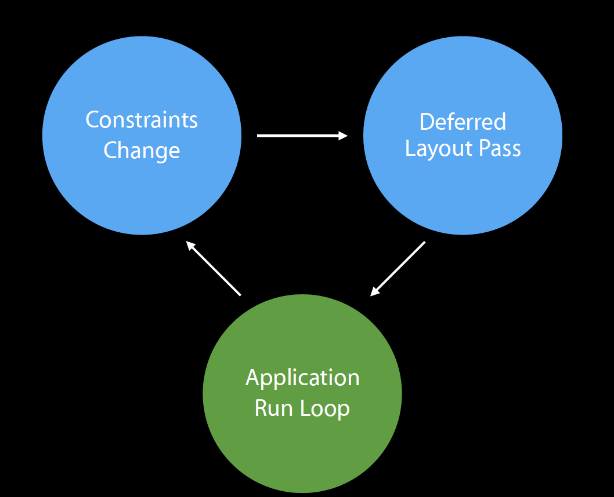

# Auto Layout
---
I've always taken for granted that whenever I make changes to constraints on a view, I'd expect the changes to get applied to the view.
This chapter will look into when & how this happens. Let's demystify auto layout.

---
## The Layout Cycle

The application manages the layout cycle on its main run loop as follows:
1. Handle events on the main dispatch queue
2. Check for constraints changes
3. If constraints have changed, schedule a deferred layout pass

---
## Registering Constraint Changes

1. Constraint changes are translated into mathematical expressions in the layout engine.
2. Based on the constraint changes, the layout engine re-computes the dimensions & coordinates of the views & controls that need to be updated.
3. These views get notified, and calls `superview.setNeedsLayout()`, causing the deferred layout pass to schedule.

---
## Deferred Layout Pass

The deferred layout pass consists of 2 passes - the update pass & the layout pass.

### The Update Pass:

The intention of the update pass is to register constraint changes for current layout pass. The layout engine traverses the view hierarchy, calling:

* [`updateViewConstraints()`](https://developer.apple.com/documentation/uikit/uiviewcontroller/1621379-updateviewconstraints) on [`UIViewController`](https://developer.apple.com/documentation/uikit/uiviewcontroller)
* [`updateConstraints()`](https://developer.apple.com/documentation/uikit/uiview/1622512-updateconstraints) on each [UIView](https://developer.apple.com/documentation/uikit/uiview)

### The Layout Pass:

Finally, the layout pass reposition affected views by assigning new dimensions & coordinates. In this pass, the layout engine traverses the view hierarchy, calling:

* [`viewWillLayoutSubviews()`](https://developer.apple.com/documentation/uikit/uiviewcontroller/1621437-viewwilllayoutsubviews) on [`UIViewController`](https://developer.apple.com/documentation/uikit/uiviewcontroller)
* [`layoutSubviews()`](https://developer.apple.com/documentation/uikit/uiview/1622482-layoutsubviews) on each [UIView](https://developer.apple.com/documentation/uikit/uiview)

---
## PreEmpting the Deferred Layout Pass

What can I do if I want to effect my layout changes right away instead of waiting until the next layout pass?

* Call [`UIView`](https://developer.apple.com/documentation/uikit/uiview)'s [`setNeedsUpdateConstraints()`](https://developer.apple.com/documentation/uikit/uiview/1622450-setneedsupdateconstraints) to trigger an update + layout pass
* Call [`UIView`](https://developer.apple.com/documentation/uikit/uiview)'s' [`setNeedsLayout()`](https://developer.apple.com/documentation/uikit/uiview/1622601-setneedslayout) to trigger a layout pass

## Wrapping Up

__Constraint Updates:__
* [`updateConstraintsIfNeeded()`](https://developer.apple.com/documentation/uikit/uiview/1622595-updateconstraintsifneeded) triggers [`updateConstraints()`](https://developer.apple.com/documentation/uikit/uiview/1622512-updateconstraints) only if constraints need updating
* [`setNeedsUpdateConstraints()`](https://developer.apple.com/documentation/uikit/uiview/1622450-setneedsupdateconstraints) triggers [`updateConstraints()`](https://developer.apple.com/documentation/uikit/uiview/1622512-updateconstraints) unconditionally
* Thus we don't ever call [`updateConstraints()`](https://developer.apple.com/documentation/uikit/uiview/1622512-updateconstraints) directly - we can override it to group constraint updates for performance.

__Layout Updates: (ie, frame changes, view added, view resizes)__
* [`layoutIfNeeded()`](https://developer.apple.com/documentation/uikit/uiview/1622507-layoutifneeded) triggers [`layoutSubviews()`](https://developer.apple.com/documentation/uikit/uiview/1622482-layoutsubviews) only if layout has changed
* [`setNeedsLayout()`](https://developer.apple.com/documentation/uikit/uiview/1622601-setneedslayout) triggers [`layoutSubviews()`](https://developer.apple.com/documentation/uikit/uiview/1622482-layoutsubviews) unconditionally
* Again, we don't call [`layoutSubview()`](https://developer.apple.com/documentation/uikit/uiview/1622482-layoutsubviews) directly - we override it if autoresizing and constraint-based behaviors of the subviews do not offer the behavior you want.

__Do Nots:__
* Do not call [`setNeedsUpdateConstraints()`](https://developer.apple.com/documentation/uikit/uiview/1622450-setneedsupdateconstraints) in [`updateConstraints`](https://developer.apple.com/documentation/uikit/uiview/1622512-updateconstraints) - this creates a feedback loop
* Do not call [`setNeedsLayout()`](https://developer.apple.com/documentation/uikit/uiview/1622601-setneedslayout) in [`layoutSubview()`](https://developer.apple.com/documentation/uikit/uiview/1622482-layoutsubviews) - this creates a feedback loop
* Do not invalidate layout of views outside the view's subtree