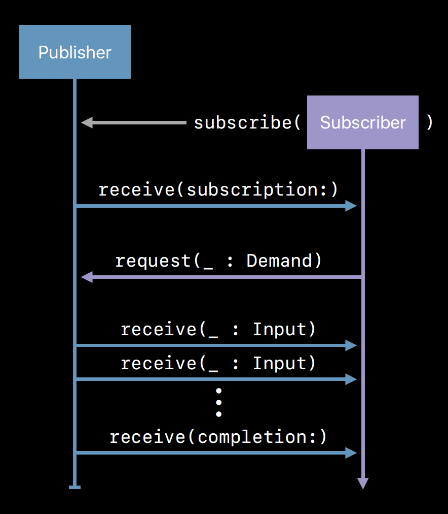

# Combine - Publisher, Subscriber & Subscription

A lot of the times we're interested in receiving updates about value and state changes over time. In the past we've relied on delegation, callbacks/closures, and notifications (NotificationCenter/Key-Value-Observation) to get it done. Today we're going to look at the publisher/subscriber pattern through Combine.

---
## Fundamental Building Blocks

Let's first establish some terminology forming the fundamental building blocks of combine:
* __Subscriber__ - Entity interested in the value changes, and expresses its interest by subscribing to a publisher
* __Subscription__ - Entity representing the connection of s subscriber to a publisher
* __Publisher__ - Entity responsible for defining how values/errors are produced, but not necessarily the content producer itself

---
## Logical Overview

On the one hand we have a publisher that can publish events over time, and on the other, a subscriber that is interested in knowing about these events - how do we connect them together? This connection is established through a third entity called a subscription. Here's a step-by-step on how it happens:



Image from [Presentation Slides, WWDC 2019, Session 722](https://devstreaming-cdn.apple.com/videos/wwdc/2019/722l6blhn0efespfgx/722/722_introducing_combine.pdf?dl=1)

1. The subscriber expresses its interest in events from the publisher by subscribing itself.
2. In turn the publisher creates a subscription sends it to the subscriber.
3. The subscriber needs to demand to the subscription the number of values it wishes to receive before it begins to receive events.
4. Publisher continues to publish events to the subscriber until either the terms of the subscription is fulfilled or an error ocurrs.

Keep this overview in mind - we will use it as a foundation to re-implement a custom version of `URLSession.DataTaskPublisher` taking the examples from [Donny Wals' post on Understanding Combine’s publishers and subscribers](https://www.donnywals.com/understanding-combines-publishers-and-subscribers/).

---
## Subscriber
### The Background:

Of all the entities involved in the event chain, the subscriber is probably the most apparent. We'll start from the sink of the chain and work our way back to the source. Let's start with the `Subscriber` protocol to get a better idea of the contract fulfilled by a concrete subscriber:

```Swift
protocol Subscriber {
    
    // A concrete subscriber must specify its:
    // 1. Input type
    // 2. Failure type - if the publisher never fails, its failure type can be declared Never
    associatedtype Input
    associatedtype Failure : Error
    
    // A subscriber can receive 3 kinds of input:
    
    // 1. A subscription
    func receive(subscription: Subscription)
    
    // 2. A value or a sequence of values
    //    The return value indicates how many more values the subscriber 
    //    expects to receive.
    func receive(_ input: Self.Input) -> Subscribers.Demand
    
    // 3. A completion event either when an error occurs or when the publisher
    //    is done with publishing events
    func receive(completion: Subscribers.Completion<Self.Failure>)
}
```

Seems straightforward for the most part - we know we need to define the type of input and error feeding into our subscriber, and provide the logic for handling values and the completion event received from the publisher. But what should our subscriber do when it receives a subscription? We haven't covered much ground with what a subscription is, but from the logical overview we know that a subscriber needs to demand to the subscription the number of values it wishes to receive before it can start receiving them. Let's look at how a subscriber is able to make demands - through `Subscribers.Demand`.

```Swift
// A requested number of items, sent to a publisher from a subscriber through the subscription
extension Subscribers {
    struct Demand, Codable, CustomStringConvertible {
    
        // A subscriber can demand a limited number of elements to be sent
        static func max(_ value: Int) -> Subscribers.Demand
        
        // A subscriber can demand an incessant number of elements to be sent
        static let unlimited: Subscribers.Demand
        
        // A subscriber can demand no elements to be sent
        static let none: Subscribers.Demand
    }
}
```

That's enough background to get us started with implementing a subscriber, so here's it is.

### The Implementation:

Below implements a concrete subscriber `DecodableDataTaskSubscriber` capable of processing responses from a URL request.

```Swift
class DecodableDataTaskSubscriber<Input: Decodable>: Subscriber {
    typealias Failure = Error
    
    // Typically, the subscriber holds on to the subscription so that
    // it can cancel the subscription later
    private var subscription: Subscription?
    
    // Subscriber receives a subscription, demand unlimited event streams 
    // from the subscription
    func receive(subscription: Subscription) {
        subscription.request(.unlimited)
    }
    
    // Subscriber receives a value, return Subscribers.Demand.none
    // to indicate that it doesn't want to receive any more values
    func receive(_ input: Input) -> Subscribers.Demand {
        print("Do something with response: \(input)")
        return .none
    }
    
    // Subscriber receives the completion event
    func receive(completion: Subscribers.Completion<Error>) {
        print("Request completed with: \(completion)")
        cancel()
    }
    
    // Use the cancel method to cancel the subscription
    func cancel() {
        subscription?.cancel()
        subscription = nil
    }
}
```
---
## Subscription
### The Background:

A subscription plays a pivotal role in publisher/subscriber binding, so it makes sense to have a closer look at what a subscription is. The `Subscription` protocol is one that all concrete subscription types must conform to. Let's look at the contract:

```Swift
protocol Subscription: Cancellable, CustomCombineIdentifierConvertible {

    // A subscriber calls this method on the subscription with a demand to let the publisher 
    // know the number of values it may send to the subscriber
    func request(_ demand: Subscribers.Demand)
}
```

Recall that our subscriber called `func request(_ demand: Subscribers.Demand)` on the subscription to make demands for values sent to it, this implementation is the only ask for a concrete subscription. Now the pieces are starting to come together. But we're introduced to a few new types here. Let's go over them:

```Swift
// Cancellable protocol is an indicator that an activity/action supports cancellation
protocol Cancellable {
    // Call cancel on a concrete Cancellable type to cancel an action/activity.
    func cancel()
}

// CustomCombineIdentifierConvertible protocol provides unique identifier to publisher streams
// A default implementation comes with its protocol extension
protocol CustomCombineIdentifierConvertible {
    var combineIdentifier: CombineIdentifier { get }
}
extension CustomCombineIdentifierConvertible where Self: AnyObject {
    public var combineIdentifier: CombineIdentifier {
        return CombineIdentifier(self)
    }
}
```

### The Implementation:

With all the background necessary to implement a concrete subscription, let's make one - the `DecodedDataTaskSubscription`.

```Swift
class DecodedDataTaskSubscription<Output: Decodable, S: Subscriber>
    where S.Input == Output, S.Failure == Error {
    
    private let urlRequest: URLRequest
    private var subscriber: S?
    
    init(urlRequest: URLRequest, subscriber: S) {
        self.urlRequest = urlRequest
        self.subscriber = subscriber
    }
}

extension DecodedDataTaskSubscription : Subscription {
    
    // Subscription protocol conformance
    // A subscriber calls this method on the subscription with a demand to let the publisher
    // know the number of values it may send to the subscriber
    func request(_ demand: Subscribers.Demand) {
        if demand > 0 {
            urlRequest.setValue("application/json", forHTTPHeaderField: "Content-Type")
            URLSession.shared.dataTask(with: urlRequest) { [weak self] data, response, error in
                defer { self?.cancel() }
                
                // Early return if subscription has been released
                guard let `self` = self else { return }
                
                // Process data task error
                // Publish completion event with error to subscriber
                guard let data = data else {
                    if let error = error {
                        self.subscriber?.receive(completion: .failure(error))
                    }
                    return
                }
                
                // Publish JSON decoded data to the subscriber followed by a completion event
                // if decode is successful
                // Publish completion event with decode error otherwise
                do {
                    self.subscriber?.receive(try JSONDecoder().decode(Output.self, from: data))
                    self.subscriber?.receive(completion: .finished)
                } catch {
                    self.subscriber?.receive(completion: .failure(error))
                }
            }.resume()
        }
    }
    
    // Cancellable protocol conformance
    func cancel() {
        subscriber = nil
    }
}
```
---
## Publisher
### The Background:

We see that a subscriber can request values from a subscription, but how does a subscription can created and passed to the subscriber in the first place? This is where a publisher comes in. Before we get into concrete publisher types, let's first have a look at the contract a publisher will need to fulfill:

```Swift
protocol Publisher {

    // A concrete publisher must specify its:
    // 1. Output type
    // 2. Failure type - if the publisher never fails, its failure type can be declared Never
    associatedType Output
    associatedType Failure : Error
    
    // A subscriber calls subscribe on the publisher to register its interest for the publisher
    // The constraints here specifies that: 
    // 1. The subscriber's input type must match the publisher's output type
    // 2. The subscriber's & publisher's error types must also match
    func subscribe<S>(_ subscriber: S) 
        where S : Subscriber, Self.Failure == S.Failure, Self.Output == S.Input
    
    // Attaches the specified subscriber to this publisher.
    func receive<S>(subscriber: S) 
        where S : Subscriber, Self.Failure == S.Failure, Self.Output == S.Input
    
    // Attaches the specified subject to this publisher.
    func subscribe<S>(_ subject: S) -> AnyCancellable 
        where S : Subject, Self.Failure == S.Failure, Self.Output == S.Output
}
```
We know we need to defining output & error types on a publisher, but what should the bodies for these methods look like? 
* `func subscribe<S>(_ subscriber: S)`
* `func receive<S>(subscriber: S)` 
* `func subscribe<S>(_ subject: S) -> AnyCancellable` 

And what is a subject anyway? We'll touch on subjects in due time, but for the time being let's start by looking at some default implementations in the `Publisher` protocol extension:

```Swift
extension Publisher {
    public func subscribe<Subscriber: Combine.Subscriber>(_ subscriber: Subscriber) 
        where Failure == Subscriber.Failure, Output == Subscriber.Input {
        
        // Call receive to attach the specified subscriber to this publisher
        receive(subscriber: subscriber)
    }

    public func subscribe<Subject: Combine.Subject>(_ subject: Subject) -> AnyCancellable
        where Failure == Subject.Failure, Output == Subject.Output {
        
        // Convert a subject into a subscriber
        let subscriber = SubjectSubscriber(subject)
        
        // Call subscribe to attach the subscriber to the publisher
        self.subscribe(subscriber)
        
        // Return a Cancellable object from the subscriber
        return AnyCancellable(subscriber)
    }
}
```
That's a bit of clarity - the protocol extension provides default implementations for 2 of the 3 methods, leaving us with `func receive<S>(subscriber: S)`. If you remember the logical overview from earlier this is where the publisher sends the subscription over to the subscriber.

### The Implementation:

Finally, here's the `DecodedDataTaskPublisher` implementation to tie everything together.

```Swift
struct DecodedDataTaskPublisher<Output: Decodable>: Publisher {
    typealias Failure = Error
    
    let urlRequest: URLRequest
    
    // When the subscriber calls subscribe on the publisher, the publisher calls this method
    func receive<S>(subscriber: S) 
        where S : Subscriber, Failure == S.Failure, Output == S.Input {
        
        // Create a subscription
        let subscription = DecodedDataTaskSubscription(urlRequest: urlRequest, subscriber: subscriber)
        
        // Send the subscription to the subscriber 
        subscriber.receive(subscription: subscription)
    }
}
```
---
## Putting Everything Together

It's time to put the pieces together and see how a publisher, subscription, and subscriber work in tandem.

```Swift
// In this example we're going to have the publisher DecodedDataTaskPublisher publish facts about the number 7 taken
// from numbersapi to the subscriber DecodableDataTaskSubscriber

// Define response data model NumberModel
struct NumberModel: Decodable {
    let text : String
    let number : Double
    let type : String
}

// Declare a publisher with data source: "http://numbersapi.com/7" and output type NumberModel
let publisher = DecodedDataTaskPublisher<NumberModel>(urlRequest: URLRequest(url: URL(string: "http://numbersapi.com/7")!))

// Declare a subscriber with matching input type NumberModel
let subscriber = DecodableDataTaskSubscriber<NumberModel>()

// Subscribe to the publisher with the subscriber
publisher.subscribe(subscriber)


// Console Output:
// ---------------------
// Received subscription
// Received value: NumberModel(text: "7 is the number of days in a week.", number: 7.0, type: "trivia")
// Received completion finished
```
