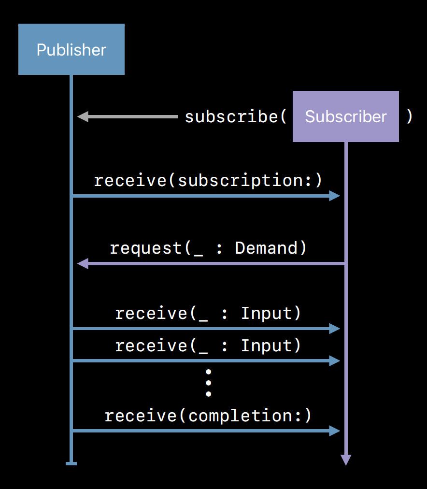

# Combine

A lot of the times we're interested in receiving updates about value and state changes over time. In the past we've relied on delegation, callbacks/closures, and notifications (NotificationCenter/Key-Value-Observation) to get it done. Today we're going to look at the publisher/subscriber approach through Combine.

## Fundamental Building Blocks

Let's first establish some terminology forming the fundamental building blocks of combine:
* __Publisher__ - Party responsible for defining how values/errors are produced, but not necessarily the content producer itself
* __Subscriber__ - Party interested in the value changes, and expresses its interest by subscribing to a publisher
* __Operator__

## Logical Overview

On the one hand we have a publisher that can publish events over time, and on the other, a subscriber that is interested in knowing about these events - how do we connect them together? This connection is established through a third party called a subscription. Here's a step-by-step on how it happens:



1. The subscriber expresses its interest in events from the publisher by subscribing itself.
2. In turn the publisher creates a subscription sends it to the subscriber.
3. The subscriber requests a number of values from the subscription before it begins to receive events.
4. Publisher continues to publish events to the subscriber until either the terms of the subscription is fulfilled or an error ocurrs.

Keep this overview in mind as it will form the foundation of our exploration in this chapter. 

---
## Publisher

```Swift
protocol Publisher {
    associatedType Output
    associatedType Failure : Error
    
    func subscribe<S>(_ subscriber: S) where S : Subscriber, Self.Failure == S.Failure, Self.Output == S.Input
}
```

```Swift
extension NotificationCenter {
    struct Publisher : Combine.Publisher {
        typealias Output = Notification
        typealias Failure = Never
        init(center: NotificationCenter, name: Notification.Name, object: Any? = nil)
    }
}
```
---
## Subscriber

```Swift
protocol Subscriber {
    associatedtype Input
    associatedtype Failure : Error
    
    func receive(subscription: Subscription)
    func receive(_ input: Self.Input) -> Subscribers.Demand
    func receive(completion: Subscribers.Completion<Self.Failure>)
}
```

```Swift
extension Subscribers {
    class Assign<Root, Input>: Subscriber, Cancellable {
        typealias Failure = Never
        init(object: Root, keyPath: ReferenceWritableKeyPath<Root, Input>)
    }
}
```
---
## Operator

```Swift
extension Publishers {

}
```
