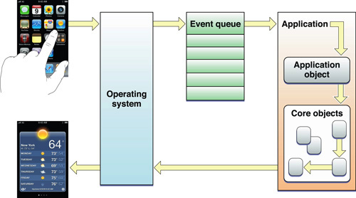
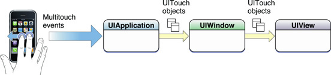

# Event-Handling & Responders
---

We know that when we add a `button` to a `view controller` or a `view` and wire up a target-action, our action method ends up getting called when the user taps on the button. 

We're going into detail about how all of this happens.

---
## Event Generation & Delivery

When a user taps on the phone's screen, a sequence of activities happen in the following order:
1. The finger creates a change in the electrostatic field at the location where the screen is touched, delivering an electric signal to the processor.

2. The operating system relays the event to the application's main event queue.

3. The event gets pulled off the event queue by the application's main run loop at some point, and is converted into an [UITouch](https://developer.apple.com/documentation/uikit/uitouch) object wrapped in an [UIEvent](https://developer.apple.com/documentation/uikit/uievent) object for dispatch.</br></br>



Image from [Apple](https://developer.apple.com/library/archive/documentation/General/Conceptual/Devpedia-CocoaApp/MainEventLoop.html#//apple_ref/doc/uid/TP40009071-CH18-SW1)</br></br>


4. This event object travels down the dispatch hierarchy following path:

__Application__ ---[`sendEvent(_:)`](https://developer.apple.com/documentation/uikit/uiapplication/1623043-sendevent)---> __Key Window__ ---[`sendEvent(_:)`](https://developer.apple.com/documentation/uikit/uiwindow/1621614-sendevent)---> __View__ ---[`hitTest(_:with:)`](https://developer.apple.com/documentation/uikit/uiview/1622469-hittest)---> __Subviews__</br></br>



Image from [Apple](https://developer.apple.com/library/archive/documentation/General/Conceptual/Devpedia-CocoaApp/EventHandlingiPhone.html#//apple_ref/doc/uid/TP40009071-CH13-SW1)

---
## Finding the Event's Intended Recipient

The purpose of event delivery is to forward the event to the view that is under the touch. To do that, the application hit-tests subviews under the `view controller`'s view and their subviews until it finds the intended recipient.

```Swift
class UIView : UIResponder {
    .
    .
    
    func hitTest(_ point: CGPoint, with event: UIEvent?) -> UIView? {
        
        // If any of the following conditions are true,
        // then myself, my subviews and their subviews cannot be the intended recipient of the touch event:
        // * I'm not user interactive, or
        // * I'm hidden, or
        // * I'm transparent, or
        // * My rect doesn't contain the touch point
        guard isUserInteractionEnabled && !isHidden && alpha > 0.01 && self.point(inside: point, with: event) else {
            return nil
        }
        
        // Otherwise, recursively call hitTest on my subviews & their subviews to find the recipient of the touch event
        for subview in subviews {
            if let view = subview.hitTest(convert(point, to: subview), with: event) {
                return view
            }
        }
        
        // If none of my subviews meet the conditions to be the recipient of the touch event, 
        // then I must be the most appropriate recipient of the event 
        return self
    }
}
```
