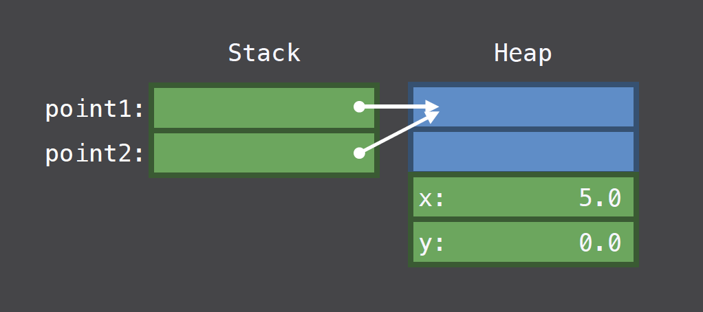

# References & Values
---
The intent of this entry is to review the differences between reference & value types, and leverage our understanding to optmize the performance of our applications. I reckon it's probably most appropriate, as a warm up to this discussion, to first revisit the fundamentals from [WWDC 2016, Session 416 - Understanding Swift Performance](https://developer.apple.com/videos/play/wwdc2016/416/).

---
## Value Types
* Value types are copied rather than shared
* Memory for value types are allocated on the call stack
* Value types come with compiler-generated memberwise initializer
* Value types do not support inheritance
---
### Value Semantics:

Below's a depiction of how simple value types are allocated in memory.


Image from [Presentation Slides, WWDC 2016, Session 416](https://devstreaming-cdn.apple.com/videos/wwdc/2016/416k7f0xkmz28rvlvwb/416/416_understanding_swift_performance.pdf?dl=1)
```Swift
// Define value type Point
struct Point {
    var x, y : Double
}

// Allocate memory for point1 on the stack & initialize (x,y) = (0,0)
let point1 = Point(x: 0, y: 0)

// Allocate memory for point2 on the stack & initialize (x,y) = (point1.x, point1.y)
var point2 = point1

// point1.x is 0, point2.x is 5
point2.x = 5
```
The example from above is naive enough, but not very interesting. Value types with value type properties are allocated on the stack - we all know that. What about value types with reference type properties?

---
### Value Types with Reference Type Properties:

To understand what really happens when we have value types with reference type properties, we'll try things out for ourselves.
```Swift
// Name Type
// Define reference type Name
final class Name {
    var firstname, lastname : String
    init(firstname: String, lastname: String) {
        (self.firstname, self.lastname) = (firstname, lastname)
    }
}
extension Name : CustomStringConvertible {
    var description: String {
        return "\(firstname) \(lastname)"
    }
}

// Person Type
// Define value type Person with reference type property Name
struct Person {
    public let name : Name
    
    // Accessors for the Person's firstname & lastname
    public var firstname : String {
        get { return name.firstname }
        set { name.firstname = newValue }
    }
    public var lastname : String {
        get { return name.lastname }
        set { name.lastname = newValue }
    }
}

// Person johnDoe has firstname "John", lastname "Doe" 
let johnDoe = Person(name: Name(firstname: "John", lastname: "Doe"))

// Create a new Person copy from johnDoe - Person janeSmith
var janeSmith = johnDoe

// Update janeSmith's first & last name
janeSmith.firstname = "Jane"
janeSmith.lastname = "Smith"

// This outputs "Jane Smith", even though we expect johnDoe's name to be "John Doe"
print(johnDoe.name)
```
What's really happening here is that we've indeed created 2 instances of Person on the stack, but these 2 instances in fact share the same reference of the Name object that's created on the heap. This is definitely not what we want, so how do we fix it?

---
### Copy-On-Write:

The idea with copy-on-write is this: having multiple objects referencing the same reference type object is fine - as long as none of these references modify the object. When the object is modified though, we'd want to create a new copy of the object. Here's how we can use copy-on-write to avoid problems with value types wrapping reference types.

```Swift
// Name Type
// Define reference type Name
final class Name {
    var firstname, lastname : String
    init(firstname: String, lastname: String) {
        (self.firstname, self.lastname) = (firstname, lastname)
    }
}
extension Name : CustomStringConvertible {
    var description: String {
        return "\(firstname) \(lastname)"
    }
}

// Person Type
// Define value type Person with reference type property Name
struct Person {
    public private(set) var name : Name
    
    // Accessors for the Person's firstname & lastname
    public var firstname : String {
        get { return name.firstname }
        set {
            // Check to see if there are other references to name,
            // if there are, create a new Name object assign the name reference to it
            if !isKnownUniquelyReferenced(&name) {
                name = Name(firstname: newValue, lastname: name.lastname)
                return
            }
            name.firstname = newValue
        }
    }
    public var lastname : String {
        get { return name.lastname }
        set {
            // Same check is done here as for firstname, but here we assign the new value to the lastname property
            if !isKnownUniquelyReferenced(&name) {
                name = Name(firstname: name.firstname, lastname: newValue)
                return
            }
            name.lastname = newValue
        }
    }
}

// Person johnDoe has firstname "John", lastname "Doe" 
let johnDoe = Person(name: Name(firstname: "John", lastname: "Doe"))

// Create a new Person copy from johnDoe - Person janeSmith
var janeSmith = johnDoe

// Update janeSmith's first & last name
janeSmith.firstname = "Jane"
janeSmith.lastname = "Smith"

// This now outputs "John Doe", as desired
print(johnDoe.name)
```

We used copy-on-write to remedy unexpected behavior with reference types wrapped in value types, but uses of copy-on-write go far beyond. For example, Swift's Array implementation reduces memory footprint by intentionally wrapping value types inside reference types, using copy-on-write (lazy copy) to avoid excessive memory allocation of large value type objects. Can you imagine a huge chunk of memory being allocated on the stack everytime a large array is assigned or passed into a function call? Just thinking about it makes my spine tingle. If we ever find ourselves in need of a similar performance boost, the template is very similar to what we have done before.

```Swift
// Reference type Ref is a value type wrapper
final class Ref<T> {
    var val : T
    init(_ v : T) {val = v}
}

struct ValueType<T> {

    // The ref variable holds the reference type Ref, 
    // and wraps the value type on initialization
    var ref : Ref<T>
    init(_ x : T) { ref = Ref(x) }

    var value: T {
        get { return ref.val }
        set {
            // If reference to ref is not unique, we want to create a new object
            if !isKnownUniquelyReferenced(&ref) {
                ref = Ref(newValue)
                return
            }
            // Otherwise just use the existing reference
            ref.val = newValue
        }
    }
}
```

## Reference Types
* Reference types are shared rather than copied
* Memory for reference types are allocated on the heap
* Reference types do not come with compiler-generated memberwise initializer
* Reference types can support inheritance



Image from [Presentation Slides, WWDC 2016, Session 416](https://devstreaming-cdn.apple.com/videos/wwdc/2016/416k7f0xkmz28rvlvwb/416/416_understanding_swift_performance.pdf?dl=1)
```Swift
// Define reference type Point
class Point {
    var x, y : Double

    // Reference types don't come with memberwise initializer
    // We need to explicitly declare one
    init(x: Double, y: Double) {
        (self.x, self.y) = (x,y)
    }
}

// 1. Allocate memory for instance of Point on the heap with (x,y) = (0,0)
// 2. Allocate memory for point1 on the stack storing address to the Point object on the heap
let point1 = Point(x: 0, y: 0)

// Allocate memory for point2 on the stack storing address to the Point object on the heap
var point2 = point1

// point2.x is 5, and point1.x is now also 5
point2.x = 5
```
Looking at the image above, it appears that the memory block allocated on the heap is more memory than is necessary to accommodate variables x & y. This is because an excess of memory is required to manage reference types.</br> 
To name a subset here: 
* __`isa` pointer__ - Reference types support inheritance, thus we need a way to walk the inheritance hierarchy in dynamic binding
* __Reference counter__ - Heap memory needs to be recycled when it's no longer in use, thus tracking active references to the memory is important

Below is a snippet simulating (simplified) compiler generated logic from the code above to illustrate what's really going on behind the scenes:
```Swift
// Retain/release imeplementations
func retain<T: ReferenceCounting>(_ object: T) {
    object.refCount+=1
}
func release<T: ReferenceCounting>(_ object: T) {
    object.refCount-=1
}

// All reference types implicitly support reference counting
protocol ReferenceCounting : class {
    var refCount : Int { get set }
}
extension Point : ReferenceCounting {}

class Point {

    // Reference types have memory allocated for reference counting
    var refCount : Int
    
    var x, y : Double
    init(x: Double, y: Double) {
        refCount = 1
        (self.x, self.y) = (x,y)
    }
}
let point1 = Point(x: 0, y: 0)
var point2 = point1

// refCount of the Point object is incremented when point2 makes reference to it
retain(point2)
point2.x = 5

// refCount of the Point object is decremented when point1 is popped off the call stack, 
// and decremented again when point2 is popped off the stack.
// Now refCount of the Point object is now 0, and can be safely recycled.
release(point1)
release(point2)
```

## Performance Metrics
### Is memory allocated on stack or heap?
* Stack - memory allocation is fast
    * Decrement & increment the stak pointer to allocate & deallocate memory.
* Heap - memory allocation is slow
    * Need to search for contiguous blocks of memory of sufficient size, potentially de-fragmenting memory blocks to satisfy the allocation
    * House-keeping post deallocation
    * Thread-safety overhead (locking mechanism) with heap access

### How much reference counting overhead is incurred at run-time?

### What portion of method calls on instances are dynamically dispatched?
